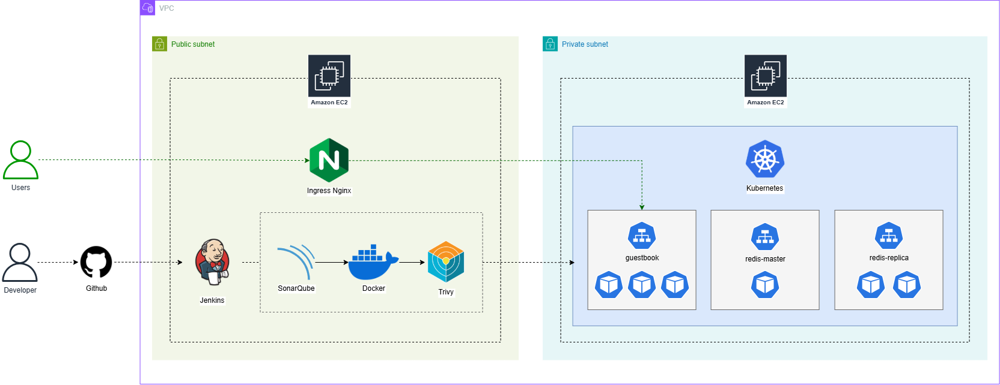

# Microservices CI/CD Pipeline with Jenkins

## Targets:

1. Use Jenkins to automate the process of building, testing, and deploying microservices applications to Docker, Kubernetes.
2. Integrate SonarQube to check the quality of the source code.
3. Integrate security testing tools: Trivy

## Architecture:

- Guideline: [guideline.md](./guideline.md)
- Demo: https://www.youtube.com/watch?v=aozEAFxrnJs&t=0s