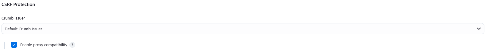

# Deploying guessbook-go
## PrivateInstance
## 1. Install Docker
```
sudo apt update

sudo apt install apt-transport-https ca-certificates curl software-properties-common

curl -fsSL https://download.docker.com/linux/ubuntu/gpg | sudo gpg --dearmor -o /usr/share/keyrings/docker-archive-keyring.gpg

echo "deb [arch=$(dpkg --print-architecture) signed-by=/usr/share/keyrings/docker-archive-keyring.gpg] https://download.docker.com/linux/ubuntu $(lsb_release -cs) stable" | sudo tee /etc/apt/sources.list.d/docker.list > /dev/null

sudo apt update

apt-cache policy docker-ce

sudo apt install docker-ce

sudo systemctl status docker

sudo usermod -aG docker ${USER}

su - ${USER}
```
## 2. Install Kubectl
```
curl -LO "https://dl.k8s.io/release/$(curl -L -s https://dl.k8s.io/release/stable.txt)/bin/linux/amd64/kubectl"

sudo install -o root -g root -m 0755 kubectl /usr/local/bin/kubectl
```
## 3. Install Minikube
```
curl -LO https://storage.googleapis.com/minikube/releases/latest/minikube-linux-amd64

sudo install minikube-linux-amd64 /usr/local/bin/minikube && rm minikube-linux-amd64
```
## 4. Deploy app
```
minikube start
```
```
kubectl apply -f guestbook-go/redis-master-controller.yaml

kubectl apply -f guestbook-go/redis-master-service.yaml

kubectl apply -f guestbook-go/redis-replica-controller.yaml

kubectl apply -f guestbook-go/redis-replica-service.yaml

kubectl apply -f guestbook-go/guestbook-controller.yaml

kubectl apply -f guestbook-go/guestbook-service.yaml
```
```
minikube tunnel
```
```
sudo tee /etc/systemd/system/guestbook-port-forward.service << EOF
[Unit]
Description=Kubernetes port forward for guestbook
After=network.target

[Service]
Type=simple
User=ubuntu
ExecStart=/usr/local/bin/kubectl port-forward --address 0.0.0.0 svc/guestbook 3000:3000
Restart=always
RestartSec=10

[Install]
WantedBy=multi-user.target
EOF
```
```
sudo systemctl daemon-reload

sudo systemctl enable guestbook-port-forward

sudo systemctl start guestbook-port-forward
```
# PublicInstance
## 1. Install Nginx
```
sudo apt update

sudo apt install nginx

systemctl status nginx

sudo nano /etc/nginx/sites-available/default
```
```
# add the following lines to /etc/nginx/sites-available/default

    location / {
        proxy_set_header Host "localhost";
        proxy_pass http://127.0.0.1:3000;
    }
```
```
sudo service nginx restart
```
Access: \<PublicInstanceIP>
## 2. Install Jenkins
```
sudo wget -O /usr/share/keyrings/jenkins-keyring.asc \
  https://pkg.jenkins.io/debian-stable/jenkins.io-2023.key

echo "deb [signed-by=/usr/share/keyrings/jenkins-keyring.asc]" \
  https://pkg.jenkins.io/debian-stable binary/ | sudo tee \
  /etc/apt/sources.list.d/jenkins.list > /dev/null

sudo apt-get update

sudo apt-get install jenkins
```
```
sudo apt update

sudo apt install fontconfig openjdk-17-jre

java -version
```
```
sudo apt update

sudo apt install -y docker.io golang

sudo usermod -aG docker jenkins

sudo systemctl restart jenkins
```
Access: \<PublicInstanceIP>:8080
## 3. Install SonarQube
```
sudo apt install nodejs
```
```
docker pull sonarqube

docker run -d --name sonarqube -p 9000:9000 sonarqube

# docker start sonarqube # whenever reboot instance
```
Access: \<PublicInstanceIP>:9000

- Create local project (guessbook-go)
- My Account > Security > Generate Tokens
## 4. Configure Jenkins
- Enable proxy compatibility



- Plugins: SSH Pipeline Steps, Go, Kubernetes, Docker, Docker Commons, Docker Pipeline, SonarQube Scanner

- Credentials: SSH key for PrivateInstance, Dockerhub credentials, Github credentials, SonarQube authentication token.


- Manage Jenkins > System > Add SonarQube (sonar-server)
- Manage Jenkins > Tools:
  - SonarQube Scanner installations (sonar-scanner)
  - Docker installations (docker)
  - Go installations (go1.20)

## 5. Create Pipeline

- Jenkins:
  - New Item > Pipeline
  - Build Triggers: GitHub hook trigger for GITScm polling
  - Pipeline: Pipeline script from SCM
- Github:
  - Repository > Settings > Webhooks > Add webhook
  - PayloadURL: http://<PublicInstanceIP>:8080/github-webhook/
  - Content type: application/json

## 6. Finish

